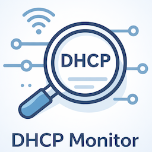

# DHCP Monitor for Home Assistant

[](https://github.com/custom-components/hacs)

This Home Assistant integration uses DHCP discovery to monitor IP address assignments on your network. 
It provides 5 sensors showing information about the last 5 detected devices.



## Features
- Detects new IP address assignments via DHCP discovery.
- 5 sensors: `sensor.dhcp_device_1` to `sensor.dhcp_device_5`.
- Attributes include: IP address, MAC address, and Hostname.

## Installation

Click the button to add this repository to HACS.

[](https://my.home-assistant.io/redirect/hacs_repository/?owner=jonnybergdahl&category=Integration&repository=HomeAssistant_Dhcp_Monitor_Integration)

### Manual
1. Download the `dhcp_monitor` folder from `custom_components`.
2. Copy it to your Home Assistant `custom_components` directory.
3. Restart Home Assistant.

## Configuration

Click the button to add a DHCP Monitor device to Home Assistant.

[](https://my.home-assistant.io/redirect/config_flow_start/?domain=dhcp_monitor)

Click OK when it asks if you want to setup the DHCP Monitor integration.

## Usage
The integration will start listening for DHCP discovery events as soon as it is configured.
The sensors will update their state with the IP address of the detected device.
Other details like MAC address and Hostname are available in the sensor attributes.

## Debug Logging
To enable debug logging for this integration, add the following to your `configuration.yaml`:

```yaml
logger:
  default: info
  logs:
    custom_components.dhcp_monitor: debug
```

## Logging
When debug logging is enabled, you should see the following keywords in your logs:
- `Registering DHCP sniffer callback`: Confirmation that the integration is listening for DHCP packets via the internal API.
- `'dhcp' integration is loaded and should be firing events`: Confirmation that the required `dhcp` component is active.
- `DHCP packet received: IP=...`: Detailed information after processing a captured DHCP packet.
- `Sensor DHCP Device X received update signal from dispatcher`: Confirmation that sensors are responding to new data.